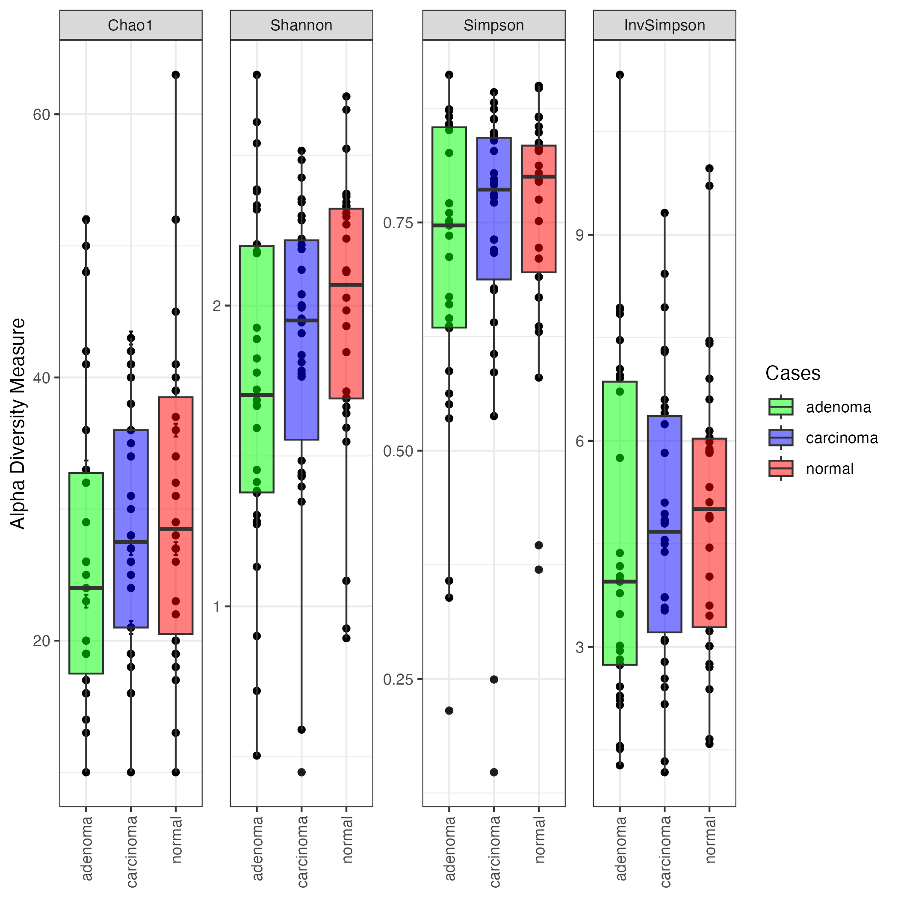

# Alpha diversity plot
This step computes and generates a plot for various alpha diversity measures (depending on the configuration). The plot visualizes alpha diversity measures for each group present in the target attribute. 

A **statistical test**, comparing alpha diversity among target groups, is also performed and results are added to the plot.

```{.python}
##########################################################
#           CREATE PHYLOSEQ OBJECT
##########################################################
rule create_phyloseq:
    input:
        table = SCRATCH + "/" + OUTPUTDIR + "/asv/" + PROJ + "-asv-table.qza",
        tree = SCRATCH + "/" + OUTPUTDIR + "/asv/" + "tree/" + PROJ + "-rooted-tree.qza",
        taxa = SCRATCH + "/" + OUTPUTDIR + "/asv/" +  PROJ + "-tax_sklearn.qza",

    output:
        phyloseq = SCRATCH + "/" + REPORTDIR + "/" + PROJ + "-phyloseq.RDS"

    log:
        SCRATCH + "/" + OUTPUTDIR + "/report/log/" + "create_phyloseq.log"

    shell:
        """
        Rscript --no-save --no-restore --verbose ./scripts/to_physeq.R -f {input.table} \
          -t {input.tree} -x {input.taxa} \
          -m {METADATA} -o {output.phyloseq} > {log} 2>&1
        """
```

## Example plot
This is an example of alpha plot generated for this step. We used here processed data from (Zackular et al., 2014).




## References
1. Zackular, J. P., Rogers, M. A., Ruffin IV, M. T., & Schloss, P. D. (2014). The human gut microbiome as a screening tool for colorectal cancer. Cancer prevention research, 7(11), 1112-1121.