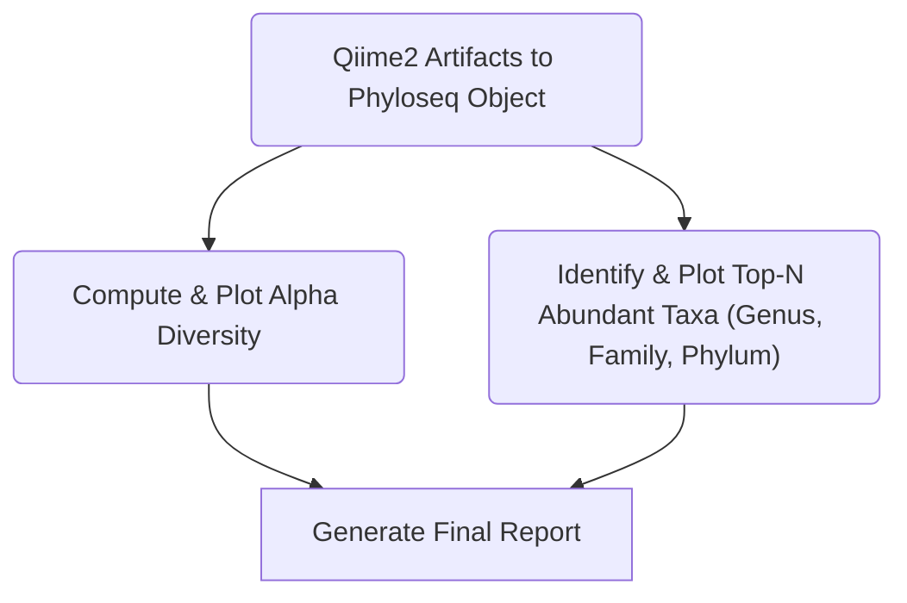

# Snakemake workflow
This section provides a brief overview of our downstream pipeline. The pipeline has been built using the **Snakemake** workflow manager. Snakemake enables the automated execution of multiple steps integrated into the pipeline in a seamless manner. The figure below shows the steps integrated in the pipeline.

For our workflow, we use a single configuration file to specify the information needed during the pipeline's execution. We will delve deeper into the configuration file in the next chapter.  
