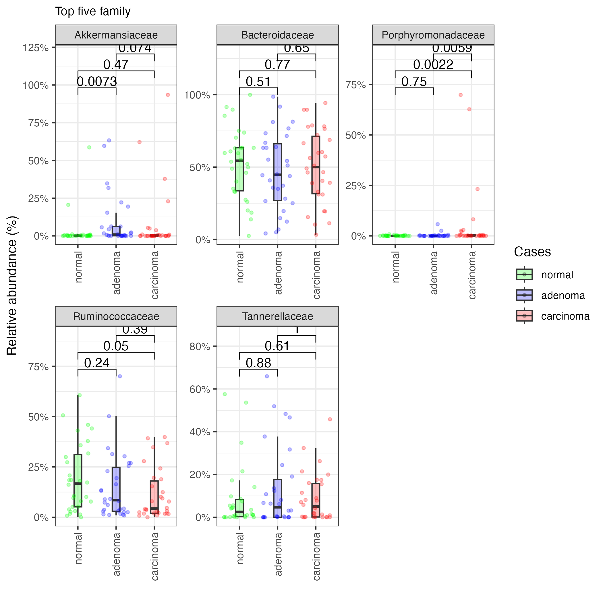

# Plot top-N abundant genera, families and phylums
This step extract top abundant taxa based on genus, family and phylum, and generate a plot. To achieve this goal, we utilize `microbiomeutilities` package. 

A **statistical test**, comparing taxa abundance among target groups, is also performed and results are added to the plot.

```{.python}

##########################################################
#          GENERATE TOP-5 GENUS, FAMILIES, PHYLUMS
##########################################################
rule create_top_taxa:
    input:
        phyloseq = SCRATCH + "/" + REPORTDIR + "/" + PROJ + "-phyloseq.RDS",
    output:
        top_genus = SCRATCH + "/" + REPORTDIR + "/" + PROJ + "-top-" + str(N) + "-genus.pdf",
        #top_family = SCRATCH + "/" + REPORTDIR + "/" + PROJ + "-top-" + N + "-families.pdf",
        #top_phylum = SCRATCH + "/" + REPORTDIR + "/" + PROJ + "-top-" + N + "-phylums.pdf"

    log:
        SCRATCH + "/" + OUTPUTDIR + "/report/log/" + "create_top_taxa.log"

    shell:
        """
        Rscript --no-save --no-restore --verbose ./scripts/plot_topn.R -p {input.phyloseq} \
          -t {TARGET} -g {TARGET_GROUPS} -c {COLORS}\
          -n {N} \
          -o {output.top_genus} > {log} 2>&1
        """
```
## Example plot
The below figure illustrates **Top-5** most abundant microbial families in the dataset.

